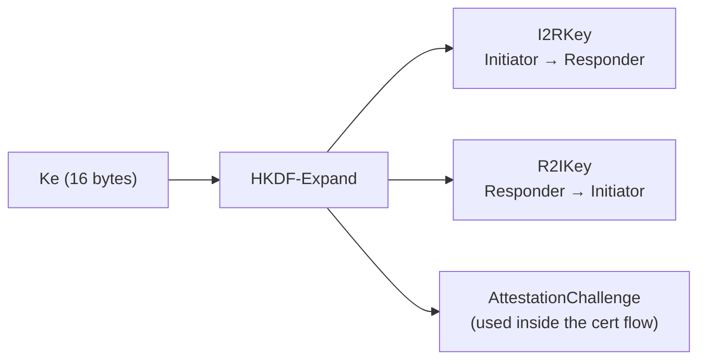
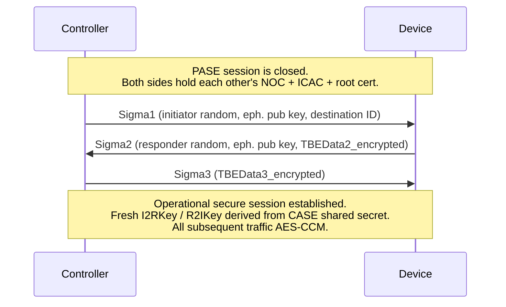

# Encryption on the Wire — What Travels in Cleartext, What Doesn't

A companion to [`PASE_Explainer.md`](./PASE_Explainer.md). PASE explains *how* a Controller and a fresh Device agree on a shared key without ever sending the passcode. This document explains what happens *next*: what subsequent traffic is encrypted, what stays cleartext, and why the protocol was designed that way.

## Two facts to set the stage

1. **The five PASE messages travel cleartext.** `PBKDFParamRequest`, `PBKDFParamResponse`, `Pake1`, `Pake2`, `Pake3` are all unsecured frames (they ride on the sentinel session ID `0`). A passive observer can capture every byte.
2. **PASE leaks nothing useful to that observer.** SPAKE2+ is a Password-Authenticated Key Exchange — both sides prove they know the same passcode without revealing it. What goes on the wire is only `pA`, `pB`, and the confirmation MACs `cA`/`cB`; none of those let an attacker recover the passcode by inspection. An *active* attacker can guess wrong, but they get one shot before the device locks the attempt out.

So PASE is a controlled, deliberate window of cleartext: just enough to bootstrap a shared secret. Everything from this point onward changes.

## From `Ke` to a secure session

When Pake3 verifies, both sides hold the same 16-byte `Ke`. That single secret is expanded through HKDF into per-direction session keys:

Once those keys are installed in the `SessionManager` and the unsecured PASE channel is retired, **every subsequent message in that session is AES-CCM encrypted** under the appropriate per-direction key. This is exactly what the Matter §5.3 AES-128-CCM primitive is for — 13-byte nonce structured per §5.3.1, 16-byte authentication tag, message header bound in as AAD.

## The rest of commissioning rides the PASE secure session

This is the part that surprises people new to the protocol: **almost all of commissioning happens *after* PASE finishes**, and all of it is encrypted. The Controller invokes a series of cluster commands inside the now-secure session:

| Step | Cluster | What's in the payload | Why encryption matters here |
|---|---|---|---|
| `ArmFailSafe` | General Commissioning (0x0030) | Fail-safe timer | Less sensitive, but still authenticated |
| `SetRegulatoryConfig` | General Commissioning | Country, location type | — |
| `CSRRequest` → `CSRResponse` | Operational Credentials (0x003E) | Device's Certificate Signing Request + attestation signature | Binds the device identity to this fabric — must not be replayable |
| `AddTrustedRootCertificate` | Operational Credentials | Fabric root CA cert | — |
| `AddNOC` | Operational Credentials | **Node Operational Cert + ICAC + IPK** | This is the fabric credential. Anyone who sees it gets operational access |
| `AddOrUpdateWiFiNetwork` / `…ThreadNetwork` | Network Commissioning (0x0031) | **Wi-Fi password / Thread network key** | Obvious — real network credentials cannot leak |
| `ConnectNetwork` | Network Commissioning | (network ID) | — |
| `CommissioningComplete` | General Commissioning | (none) | Finalises the fabric installation |

So once Pake3 succeeds, **there is no further cleartext traffic during commissioning**. The Wi-Fi password, the Thread network key, the Node Operational Certificate — none of these ever reach the wire in the clear.

## Then CASE swaps keys

The PASE session is *temporary*. Its only job is to install the fabric credential into the device. After `CommissioningComplete`, the Controller drops PASE entirely and starts a new handshake — **CASE** (Certificate-Authenticated Session Establishment) — using the certificates that were just provisioned.

CASE has three messages:

A few subtleties worth flagging:

* **Sigma1/2/3 frames are unsecured** at the frame level — just like PASE messages. But Sigma2 and Sigma3 carry **inner encrypted blobs** (`TBEData2_encrypted`, `TBEData3_encrypted`) that are sealed with intermediate keys derived during CASE itself. So the *frames* are cleartext but the *sensitive contents* (the certificates exchanged for mutual authentication) are not.
* **Mutual authentication is certificate-based**, not passcode-based. Each side proves it holds a private key whose certificate was signed by the fabric root.
* **Session keys come from the CASE shared secret, not from `Ke`.** PASE keys are forgotten the moment CASE completes. Each fresh CASE session produces a fresh `I2RKey` / `R2IKey`.

After Sigma3, the operational secure session is live, and all ongoing traffic — light on/off, attribute reads, subscriptions, lock control, command invocations — flows through it AES-CCM encrypted.

## What's ever truly cleartext

Across the device's entire lifetime, only these messages are visible to a passive observer:

* The **5 PASE messages**, once during commissioning.
* The **3 CASE Sigma messages**, once per controller reconnect (so periodically, but always short-lived).
* **mDNS discovery records** advertising the device on the local network.
* **Standalone MRP Acks** before any session exists.

Everything else — every command, every read, every write, every subscription report — is encrypted under either a PASE-derived key (during commissioning) or a CASE-derived key (during operation).

## Where this maps to `go-matter`

| Phase | Status in this repo |
|---|---|
| PASE messages 1–5 | Implemented (`commissioning/commissioner.go`, `commissioning/commissionee.go`) — both sides reach `StateComplete` with matching `Ke`. |
| AES-128-CCM primitive | Implemented (`crypto/crypto.go` via `github.com/pion/dtls/v3/pkg/crypto/ccm`). 13-byte nonce, 16-byte tag, locked-vector test. |
| `Ke` → session keys (HKDF expansion) | TODO §11 + §21. |
| `NonceGenerator.NextNonce` per Matter §5.3.1 | TODO §9. |
| `SessionManager.{Encrypt,Decrypt}Payload` actually encrypting | TODO §12–15. |
| ArmFailSafe → CommissioningComplete | TODO §31–36 (Interaction Model) + §38 (cluster catalogue, especially General Commissioning, Operational Credentials, Network Commissioning). |
| CASE Sigma1/2/3 | TODO §24–27. |
| Operational traffic over CASE | TODO §31+ once §24–27 land. |

The AES-CCM work just landed is the gate that makes "secure session traffic" possible at all. The next steps (`NextNonce`, variable-length HKDF, session-layer encrypt/decrypt) are what turn that gate into encrypted bytes on the wire.
