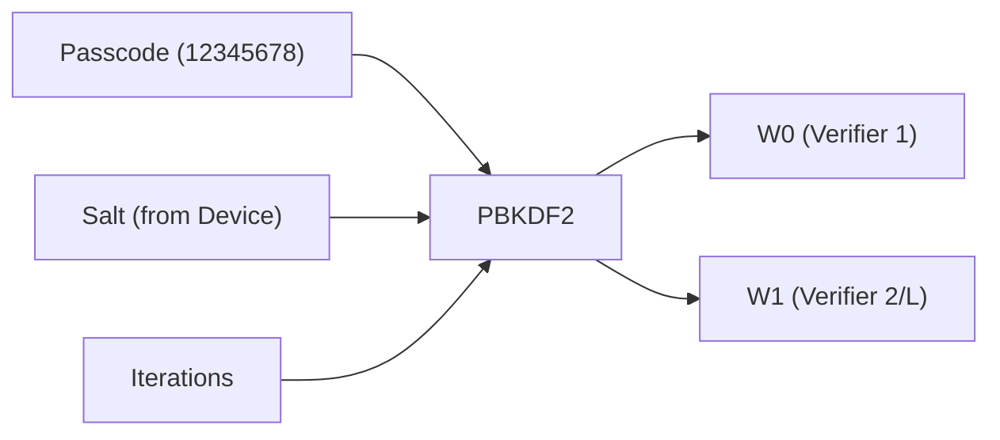
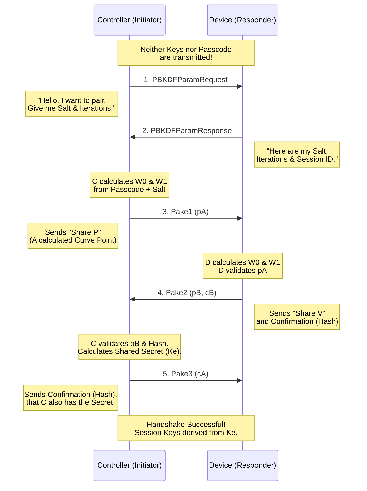
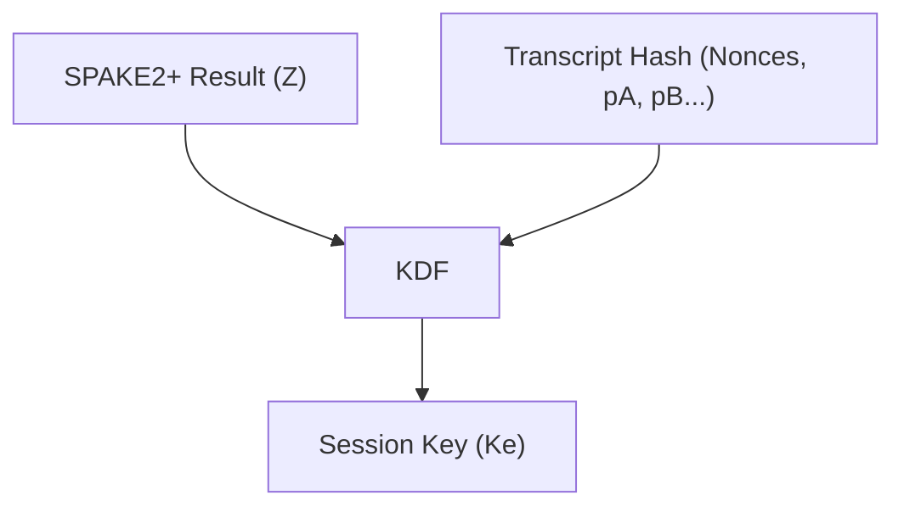

# PASE (Passcode Authenticated Session Establishment) Explanation

PASE is the protocol used by Matter to establish an **initial secure connection** between a Controller (You/Commissioner) and a new Device (Commissionee). Since the devices do not know each other yet and have exchanged no certificates, trust is based on a **Setup Passcode** (the 8-digit code on the device/QR code).

## The Core Concept: SPAKE2+

Matter uses **SPAKE2+** (Simple Password Authenticated Key Exchange). The genius part: **The passcode is never sent over the network.**

Instead, both sides use the passcode as a mathematical basis to calculate two secrets. If both sides have the same passcode, they arrive at the same "Shared Secret Key" at the end of the calculation. If one lies or uses the wrong code, the results do not match, and the handshake fails.

### Step 1: From Passcode to Cryptographic Parameters (PBKDF)

The passcode (e.g., `12345678`) is too weak for direct cryptography. Therefore, it is "hardened".
The device ("Responder") provides a random **Salt** and a number of **Iterations**.

*   **W0 & W1** are large numbers (points on an elliptic curve) needed for the SPAKE2+ calculation.
*   Both sides must calculate `W0` and `W1`. To do this, the Controller must first query the Salt and Iterations from the device.

---

## The PASE Handshake Flow

Here is the flow as implemented in the `commissioning` package:

### Detailed Explanation of Messages

1.  **PBKDFParamRequest**: The Controller starts and says "Let's begin". It sends a random nonce ("Initiator Random").
2.  **PBKDFParamResponse**: The device responds with the ingredients the Controller needs to convert the passcode into `W0`/`W1`.
3.  **Pake1**: The Controller chooses a random number (x), computes with `W0`, and sends the result (Point `pA` or `X`) to the device.
4.  **Pake2**: The device chooses a random number (y), computes with `W0`, and sends the result (Point `pB` or `Y`). Additionally, it sends a hash (`cB`) proving: "I know the passcode (W0/W1) and have seen your `pA`."
5.  **Pake3**: The Controller verifies the hash. If correct, it sends its hash (`cA`) back: "I also know the passcode and have seen your `pB`."

## Result: Encryption

At the end, both sides (without ever sending the passcode) have calculated a shared secret **Ke** (Session Key).
From now on, all messages are encrypted with this **Ke** using **AES-CCM**.

### Detailed Answers to Specific Questions

#### 1. "Iterations" – What is getting iterated?
*   **What is it?** A number (e.g., 2000) indicating how many times the passcode is "spun" through a hash function (PBKDF2 algorithm).
*   **Purpose:** It makes calculating the passcode artificially slow. This protects against brute-force attacks if an attacker steals the Salt. A user barely notices the difference between 1x vs 1000x, but a hacker trying billions of passwords per second is slowed down 1000x.
*   **Origin:** The **Device Manufacturer** sets this value (hardcoded in firmware or config). The Controller requests it in the first step (`PBKDFParamRequest`) to perform the same calculation. Matter mandates a minimum (typically min. 1000).

#### 2. "Initiator Random" (Nonce) – What is it for?
*   It feeds into the "Context" of the handshake.
*   At the end of the handshake, the Session Key is derived not just from the mathematical result of SPAKE2+, but also from the **Transcript** (the sum of all exchanged data).
*   **Purpose:** Since `Random` is different every time, the **Session Key is completely different every time**, even if pairing the same device with the same passcode again. This prevents "Replay Attacks" (an attacker cannot simply replay an old recorded session).

#### 3. Does the Device validate `pA`? Does it use it for `pB`?
*   **Validation:** Yes! The device mathematically verifies if point `pA` actually lies on the elliptic curve. If `pA` is invalid (e.g., Infinity Point or wrong coordinates), the device aborts immediately.
*   **Usage:** The device does **not** use `pA` to calculate its own `pB`. `pB` is based only on its own random value `y` and the passcode parameter `W0`.
*   **However:** The device uses `pA` to calculate the **Shared Secret (Z)**.
    *   Simplified Formula: `Z = h * y * (pA - W0*M)`
    *   You see: Without `pA` from the Controller, the device cannot calculate the secret `Z`.

    **Explanation of Variables:**
    *   **h (Cofactor):** A fixed value of the elliptic curve (for P-256, h=1). It plays a role in security but is technically a constant.
    *   **y (Ephemeral Private Key):** The **secret random number** of the device (Responder) rolled for this single handshake. The counterpart at the Controller is `x`.
    *   **M & N (Protocol Constants):** These are two fixed, publicly known points on the curve defined in the SPAKE2+ standard. They have nothing to do with the password but are "anchor points" for the math.
        *   The Controller uses `M` for calculation.
        *   The device uses `N` for calculation.
    *   **pA (Public Key A):** The message from the Controller.

#### 4. How is the Session Key calculated?
The Session Key is created at the very end in a "Key Derivation Function" (KDF). The ingredients are:
1.  **The Shared Secret (Z):** The mathematical result of SPAKE2+ (which can only be calculated if both know the passcode).
2.  **The Hash Values (Transcript):** A hash over all messages sent back and forth (`PBKDFParamRequest`, `Random`, `pA`, `pB`, etc.).

The result `Ke` is then split into encryption keys for both directions (I2RKey, R2IKey).
