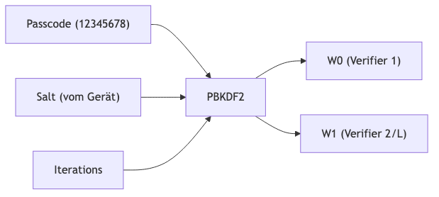
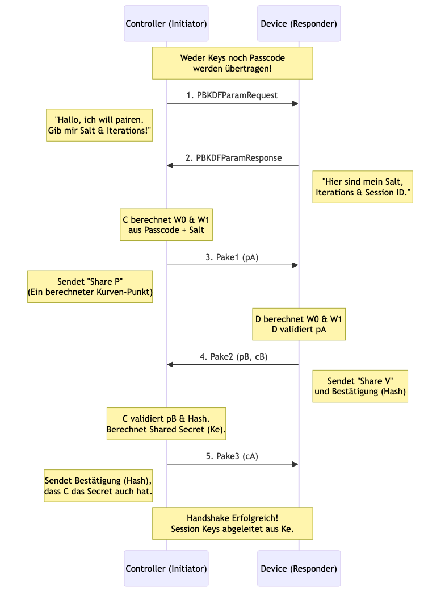
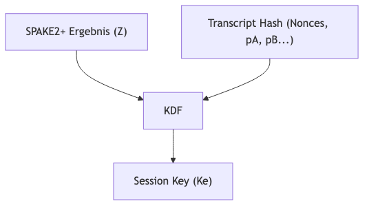

# PASE (Passcode Authenticated Session Establishment) Erklärung

PASE ist das Protokoll, das Matter nutzt, um eine **erste sichere Verbindung** zwischen einem Controller (Dir/Commissioner) und einem neuen Gerät (Commissionee) herzustellen. Da sich die Geräte noch nicht kennen und keine Zertifikate ausgetauscht haben, basiert das Vertrauen auf einem **Setup Passcode** (der 8-stellige Code auf dem Gerät/QR-Code).

## Das Kern-Konzept: SPAKE2+

Matter nutzt **SPAKE2+** (Simple Password Authenticated Key Exchange). Das Geniale daran: **Der Passcode wird niemals über das Netzwerk gesendet.**

Stattdessen nutzen beide Seiten den Passcode als mathematische Basis, um zwei Geheimnisse zu berechnen. Wenn beide Seiten den gleichen Passcode haben, kommen sie am Ende der Berechnung auf den gleichen "Shared Secret Key". Wenn einer lügt oder den falschen Code hat, passt das Ergebnis nicht zusammen und der Handshake schlägt fehl.

### Schritt 1: Vom Passcode zu kryptografischen Parametern (PBKDF)

Der Passcode (z.B. `12345678`) ist zu schwach für direkte Kryptografie. Deshalb wird er "gehärtet".
Das Gerät ("Responder") liefert einen zufälligen **Salt** und eine Anzahl von **Iterationen**.

*   **W0 & W1** sind große Zahlen (Punkte auf einer elliptischen Kurve), die für die SPAKE2+ Berechnung benötigt werden.
*   Beide Seiten müssen `W0` und `W1` berechnen. Dafür muss der Controller zuerst den Salt und die Iterations vom Gerät abfragen.

---

## Der PASE Handshake Ablauf

Hier ist der Ablauf, wie er im `commissioning` Paket implementiert wird:

### Detaillierte Erklärung der Nachrichten

1.  **PBKDFParamRequest**: Der Controller startet und sagt "Lass uns anfangen". Er schickt eine zufällige Nonce ("Initiator Random").
2.  **PBKDFParamResponse**: Das Gerät antwortet mit den Zutaten, die der Controller braucht, um den Passcode in `W0`/`W1` umzuwandeln.
3.  **Pake1**: Der Controller wählt eine Zufallszahl (x), verrechnet sie mit `W0` und schickt das Ergebnis (Punkt `pA` bzw. `X`) an das Gerät.
4.  **Pake2**: Das Gerät wählt eine Zufallszahl (y), verrechnet sie mit `W0`, und schickt das Ergebnis (Punkt `pB` bzw. `Y`). Zusätzlich schickt es einen Hash (`cB`), der beweist: "Ich kenne den Passcode (W0/W1) und habe dein `pA` gesehen."
5.  **Pake3**: Der Controller prüft den Hash. Wenn korrekt, schickt er seinen Hash (`cA`) zurück: "Ich kenne auch den Passcode und habe dein `pB` gesehen."

## Ergebnis: Verschlüsselung

Am Ende haben beide Seiten (ohne den Passcode je gesendet zu haben) ein gemeinsames Geheimnis **Ke** (Session Key) berechnet.
Ab jetzt werden alle Nachrichten mit diesem **Ke** und **AES-CCM** verschlüsselt.

### Detaillierte Antworten auf deine Fragen

#### 1. "Iterationen" – Was ist das und woher kommt es?
*   **Was ist es?** Eine Zahl (z.B. 2000), die angibt, wie oft der Passcode durch eine Hash-Funktion "gedreht" wird (PBKDF2 Algorithmus).
*   **Zweck:** Es macht den Passcode künstlich langsam zu berechnen. Das schützt gegen Brute-Force-Angriffe, falls ein Angreifer den Salt klaut. Für den User merkt man bei 1x vs 1000x kaum einen Unterschied, aber ein Hacker, der Milliarden Passwörter pro Sekunde probieren will, wird 1000x verlangsamt.
*   **Ursprung:** Der **Gerätehersteller** legt diesen Wert fest (Hardcoded in der Firmware oder Config). Der Controller fragt ihn im ersten Schritt (`PBKDFParamRequest`) ab, damit er die gleiche Rechnung durchführen kann. Matter schreibt ein Minimum vor (typischerweise min. 1000).

#### 2. "Initiator Random" (Nonce) – Wozu dient er?
*   Er fließt in den "Context" des Handshakes ein.
*   Am Ende des Handshakes wird der Session Key nicht nur aus dem mathematischen Ergebnis von SPAKE2+ berechnet, sondern es fließt auch das **Transkript** (die Summe aller ausgetauschten Daten) mit ein.
*   **Zweck:** Da der `Random` jedes Mal anders ist, ist auch der **Session Key jedes Mal komplett anders**, selbst wenn man das gleiche Gerät mit dem gleichen Passcode nochmal pairt. Das verhindert "Replay-Attacken" (ein Angreifer kann nicht einfach eine alte aufgezeichnete Session nochmal abspielen).

#### 3. Validiert das Gerät `pA`? Nutzt es ihn für `pB`?
*   **Validierung:** Ja! Das Gerät prüft mathematisch, ob der Punkt `pA` tatsächlich auf der elliptischen Kurve liegt. Wenn `pA` ungültig ist (z.B. Infinity-Point oder falsche Koordinaten), bricht das Gerät sofort ab.
*   **Nutzung:** Das Gerät nutzt `pA` **nicht**, um sein eigenes `pB` zu berechnen. `pB` basiert nur auf dem eigenen Zufallswert `y` und dem Passcode-Parameter `W0`.
*   **Aber:** Das Gerät nutzt `pA`, um das **gemeinsame Geheimnis (Z)** zu berechnen.
    *   Formel vereinfacht: `Z = h * y * (pA - W0*M)`
    *   Du siehst: Ohne das `pA` vom Controller kann das Gerät das Geheimnis `Z` nicht berechnen.

    **Erklärung der Variablen:**
    *   **h (Cofactor):** Ein fester Wert der elliptischen Kurve (bei P-256 ist h=1). Er spielt für die Sicherheit eine Rolle, ist aber technisch gesehen eine Konstante.
    *   **y (Ephemeral Private Key):** Die **geheime Zufallszahl** des Geräts (Responders), die es für diesen einen Handshake gewürfelt hat. Das Gegenstück beim Controller ist `x`.
    *   **M & N (Protocol Constants):** Das sind zwei feste, öffentlich bekannte Punkte auf der Kurve, die im SPAKE2+ Standard definiert sind. Sie haben nichts mit dem Passwort zu tun, sondern sind "Ankerpunkte" für die Mathematik.
        *   Der Controller nutzt `M` zur Berechnung.
        *   Das Gerät nutzt `N` zur Berechnung.
    *   **pA (Public Key A):** Die Nachricht vom Controller.

#### 4. Woraus wird der Session Key berechnet?
Der Session Key entsteht ganz am Schluss in einer "Key Derivation Function" (KDF). Die Zutaten sind:
1.  **Das Shared Secret (Z):** Das mathematische Ergebnis von SPAKE2+ (das, was nur berechnet werden kann, wenn beide den Passcode kennen).
2.  **Die Hash-Werte (Transcript):** Ein Hash über alle Nachrichten, die hin und her geschickt wurden (`PBKDFParamRequest`, `Random`, `pA`, `pB` usw.).

Das Ergebnis `Ke` wird dann zerteilt in Encryption-Keys für beide Richtungen (I2RKey, R2IKey).
